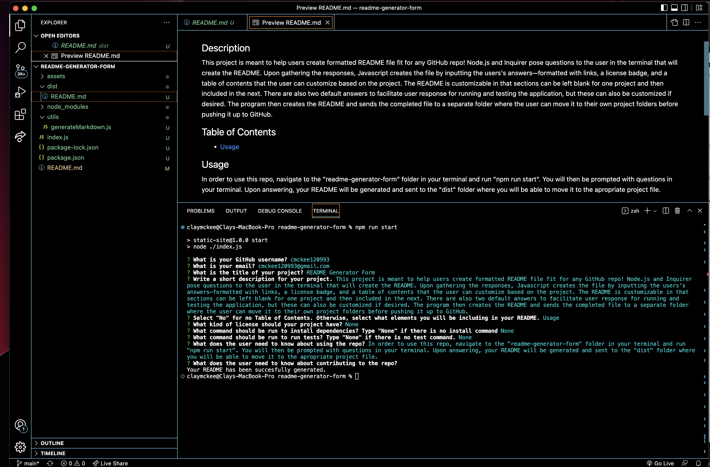

# README Generator Form
 

  

  
 ## Description
  
 This project is meant to help users create formatted README file fit for any GitHub repo! Node.js and Inquirer pose questions to the user in the terminal that will create the README. Upon gathering the responses, Javascript creates the file by inputting the users's answers—formatted with links, a license badge, and a table of contents that the user can customize based on the project. The README is customizable in that sections can be left blank for one project and then included in the next. There are also two default answers to facilitate user response for running and testing the application, but these can also be customized if desired. The program then creates the README and sends the completed file to a separate folder where the user can move it to their own project folders before pushing it up to GitHub.
 
 ## Table of Contents
 * [Usage](#usage)
 
 ## Usage
  
 In order to use this repo, navigate to the "readme-generator-form" folder in your terminal and run "npm run start". You will then be prompted with questions in your terminal. Upon answering, your README will be generated and sent to the "dist" folder where you will be able to move it to the apropriate project file.
 
 
 
## Questions 

 If you have any questions, email me at cmckee120993@gmail.com. 

 You can view more of my work at [cmckee120993](https://github.com/cmckee120993).

 ## Program in Use

Click on the screenshot above to be taken to a video recording of this project in action. 

 ### Note
 Except for the video of the site being used and this final note, this README was created using the README generator! 